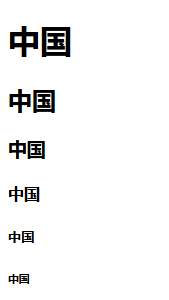

# 2 HTML5中常用标签

## 2.1 标题标签"h1~h6"

示例代码：

	<!DOCTYPE html>
	<html lang="en">
	<head>
		<meta charset="UTF-8">
		<title>静夜思</title>
	</head>
	<body>
		<!-- 
			注释：在HTML文件中注释不参与代码的执行。快捷键:crtl+/
		 -->
		 <!-- 
			标题标签：h1~h6
		  -->
		  <h1>中国</h1>
		  <h2>中国</h2>
		  <h3>中国</h3>
		  <h4>中国</h4>
		  <h5>中国</h5>
		  <h6>中国</h6>
	
	</body>
	</html>

  

特点：  
1：文本内容会被加粗  
2：每一个标签都会独占一行  
3：从h1~h6字体大小逐渐递减  