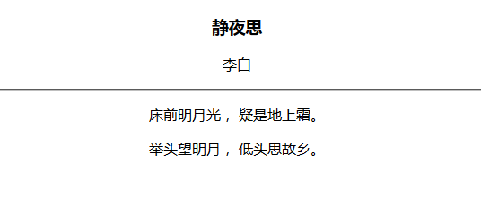

## 2.2 段落标签"

"

示例代码：

	<!DOCTYPE html>
	<html lang="en">
	<head>
		<meta charset="UTF-8">
		<title>静夜思诗句</title>
	</head>
	<body>
		

			<h3>静夜思</h3>
			
李白

			

			
床前明月光， 疑是地上霜。

			
举头望明月， 低头思故乡。

		

	</body>
	</html>

  

特点：将文本内容按段落方式进行划分。  
示例中包括水平hr标签，该标签的特点为只有要给标签，并不是成对出现。  
还包括一个剧中center标签,该标签的作用为剧中显示。