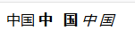

## 2.3 加粗标签“<strong></strong>”

示例代码：

	<!DOCTYPE html>
	<html lang="en">
	<head>
		<meta charset="UTF-8">
		<title>Document</title>
	</head>
	<body>
	
		<!-- 
			strong：可以将标签中的内容加粗
		 -->
		 中国
		 <strong>中&nbsp;&nbsp;&nbsp;国</strong>
		 <!-- 
			em：斜体字标签
		 -->
		 <em>中 国</em>
	
	</body>
	</html>

 
