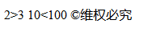

## 2.4 特殊符号标签

示例代码：

	<!DOCTYPE html>
	<html lang="en">
	<head>
		<meta charset="UTF-8">
		<title>Document</title>
	</head>
	<body>
		 <!-- 
			特殊字符：
				空格:&nbsp;
				>:&gt;
				<:&lt;
				版权符号:&copy;
		  -->
		  <!-- 
				ctrl+"+"：将代码放大
				ctrl+"-"：缩小代码字体
		   -->
		  2&gt;3
		  10&lt;100
		  &copy;维权必究
	</body>
	</html>

 
