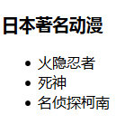

## 2.6 无序标签

示例代码：

	<!DOCTYPE html>
	<html lang="en">
	<head>
		<meta charset="UTF-8">
		<title>html5常用标签3</title>
	</head>
	<body>
		<!-- 
			无序标签：ul、li
		 -->
		 <h3>日本著名动漫</h3>
		 <ul>
			<li>火隐忍者</li>
			<li>死神</li>
			<li>名侦探柯南</li>
		 </ul>	  
	</body>
	</html>

 
