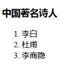

## 2.7 有序标签

示例代码：

	<!DOCTYPE html>
	<html lang="en">
	<head>
		<meta charset="UTF-8">
		<title>html5常用标签3</title>
	</head>
	<body>
		 <!-- 
			有序标签：ol、li
		  -->
		  <h3>中国著名诗人</h3>
		  <ol>
			<li>李白</li>
			<li>杜甫</li>
			<li>李商隐</li>
		  </ol>
	</body>
	</html>

 