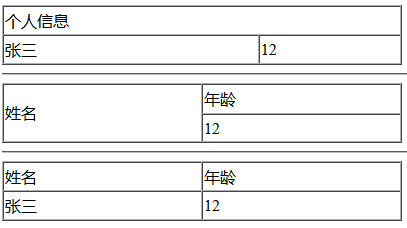

## 2.8 表格标签

示例代码：

	<!DOCTYPE html>
	<html lang="en">
	<head>
		<meta charset="UTF-8">
		<title>表格标签演示</title>
	</head>
	<body>
		<!-- 
			border：指定表格线的宽度
		 -->
		<table border="1px" width="400px" height="60px" cellspacing="0px">
			<tr>
				<td colspan="2">个人信息</td>
			</tr>
			<tr>
				<td>张三</td>
				<td>12</td>
			</tr>
		</table>
		

		

		<table border="1px" width="400px" height="60px" cellspacing="0px">
			<tr>
				<td rowspan="2">姓名</td>
				<td>年龄</td>
			</tr>
			<tr>
				<td>12</td>
			</tr>
		</table>
	</body>
	</html>

 