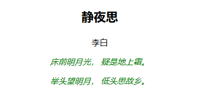

## 5.1 CSS3的几种方式

 

### 5.1.1 第一种方式（行内样式）

示例代码：

	<!DOCTYPE html>
	<html lang="en">
	<head>
		<meta charset="UTF-8">
		<title>css的第一种书写方式（行内样式）</title>
	</head>
	<body>
		

			<!-- 
				在css中font-size：代表的是字体的大小
				color:代表的是字体的颜色
				font-weight:代表的是字体是否加粗
				font-sytle：控制字体的样式，比如是否为斜体
			 -->
			
静夜思

			
李白

			
床前明月光， 疑是地上霜。

			
举头望明月， 低头思故乡。

		

	</body>
	</html>

### 5.1.2 第二种方式（行内样式表）

示例代码：

	<!DOCTYPE html>
	<html lang="en">
	<head>
		<meta charset="UTF-8">
		<title>css的第2种书写方式（行内样式表）</title>
		
	</head>
	<body>
		

			
静夜思

			
李白

			
床前明月光， 疑是地上霜。

			
举头望明月， 低头思故乡。

		

	</body>
	</html>

### 5.1.3 第三种方式（外部样式表）

示例代码：

	<!DOCTYPE html>
	<html lang="en">
	<head>
		<meta charset="UTF-8">
		<title>css的第3种书写方式（外部样式表）</title>
		<link rel="stylesheet" type="text/css" href="./css/1.css">
	</head>
	<body>
		

			
静夜思

			
李白

			
床前明月光， 疑是地上霜。

			
举头望明月， 低头思故乡。

		

	</body>
	</html>

