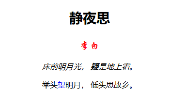

## 5.2 CSS字体样式

### 5.2.1 字体样式

* font-family：字体类型
* font-size：字体大小
* font-style：字体风格
* font-weight：字体粗细

### 5.2.2 span标签

如果一段文本内容中的某一个字体需要单独的样式，可以将这个字体放入到标签中去，然后再使用样式来修饰这个标签。

### 5.2.3 示例演示

 

示例代码：

	<!DOCTYPE html>
	<html lang="en">
	<head>
		<meta charset="UTF-8">
		<title>字体样式</title>
	</head>
	<body>
		

			
静夜思

			
李白

			
床前明月光， 疑是地上霜。

			
举头望明月， 低头思故乡。

		

	</body>
	</html>

