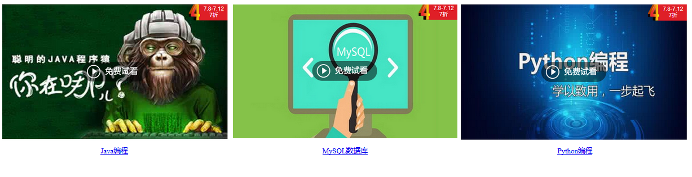

## 5.3 伪标签样式

### 5.3.1 a标签

a标签为链接标签，可以实现很多网站的导航栏效果。

### 5.3.2 伪类样式

* a:link：未访问时的链接样式
* a:hover：鼠标悬停到链接部分时的样式
* a:visited：访问后的链接样式
* a:active: 鼠标单击未释放的超链接样式

### 5.3.3 案例综合演示

 

	<!DOCTYPE html>
	<html lang="en">
	<head>
		<meta charset="UTF-8">
		<title>伪类样式</title>
		
	</head>
	<body>
		<table>
			<tr>
				<td>
					
				</td>
				<td>
					
				</td>
				<td>
					
				</td>
			</tr>
			<tr style="text-align: center">
				<td><a href="http://edu.51cto.com/course/10385.html">Java编程</a></td>
				<td><a href="http://edu.51cto.com/course/10373.html">MySQL数据库</a></td>
				<td><a href="http://edu.51cto.com/course/10408.html">Python编程</a></td>
			</tr>
		</table>
	</body>
	</html>

### 5.3.4 总结