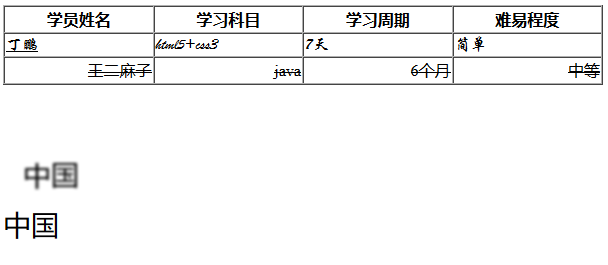

## 5.4 文本样式

### 5.4.1 文本样式

* text-align：水平居中
* line-height：行高
* text-decoration：设置文本的修饰符(如删除线、下划线等)
* text-indent：设置文本的首行缩进，单位是px
* text-shadow：设置文本的阴影效果

### 5.4.2 案例演示

 

	<!DOCTYPE html>
	<html lang="en">
	<head>
		<meta charset="UTF-8">
		<title>文本样式综合案例</title>
	</head>
	<body>
		<table width="600px" height="80px" border="1px" cellspacing="0px">
			<tr style="text-align: center;font-weight: bolder">
				<td>学员姓名</td>
				<td>学习科目</td>
				<td>学习周期</td>
				<td>难易程度</td>
			</tr>
			<tr style="text-align: left;font-family: '华文行楷'">
				<td style="text-decoration: underline;">丁鹏</td>
				<td>html5+css3</td>
				<td>7天</td>
				<td>简单</td>
			</tr>
			<tr style="text-align: right;text-decoration: line-through">
				<td>王二麻子</td>
				<td>java</td>
				<td>6个月</td>
				<td>中等</td>
			</tr>
		</table>
	     
		<!-- 
			text-shadow：控制文本的阴影效果
			x:指明阴影相对于文本的水平距离
			y:指明阴影相对于文本的垂直距离
			z:指定阴影的模糊程度，值越大越模糊
			color：指定阴影的颜色
		 -->
		中国
	</body>
	</html>

案例中使用了table标签作为布局，使用font样式来控制字体，使用了文本样式来对字体进行修饰

### 5.4.3 总结

常用的文本样式有：text-align（文本对齐方式，left、center、right），text-decoration（文本修饰符，underline、linethrough）