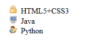

## 5.5 列表样式

### 5.5.1 列表样式

list-style-type：列表样式类型

常用的取值有：
* none：无标记符号
* disc：实心圆
* circle：空心圆
* decimal：数字
* square：实心正方形

list-style-image：列表样式图片

 

### 5.5.2 案例演示

	<!DOCTYPE html>
	<html lang="en">
	<head>
		<meta charset="UTF-8">
		<title>列表样式</title>
		
	</head>
	<body>
		<ul>
			<li style="list-style-image:url(./images/login.png)">HTML5+CSS3</li>
			<li style="list-style-image:url(./images/system.png)">Java</li>
			<li style="list-style-image:url(./images/user.png)">Python</li>
		</ul>
	</body>
	</html>

### 5.5.3 总结

ul、li是一对组合标签，表示的是无序列表。可以通过list-styletype将ul、li标签前面的默认项目符号去掉。
通过list-style-image可以讲ul、li前面默认的项目符号换成指定的图片。

