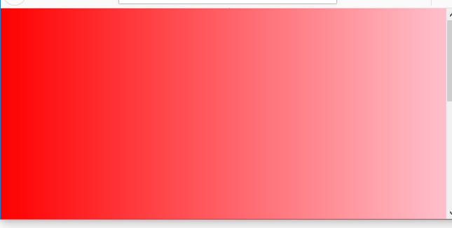

## 5.6 背景样式

### 5.6.1 背景样式

* background-color：背景颜色
* background-image：背景图片
* background-repeat：背景图片平铺

	<!DOCTYPE html>
	<html lang="en">
	<head>
		<meta charset="UTF-8">
		<title>网页样式</title>
		
	</head>
	<body>
	</body>
	</html>

### 5.6.2 线性渐变

 

	<!DOCTYPE html>
	<html lang="en">
	<head>
		<meta charset="UTF-8">
		<title>网页样式</title>
		
	</head>
	<body>
	</body>
	</html>

### 5.6.3 总结

* 背景样式大都以”background-”作为前缀
* background-color：可以控制背景的颜色，例如：background-color：red、background-color：#123456
* background-image：用来指定背景图片，格式为:background:url(图片路径名)
* background-repeat：指定背景图片是否平铺，常用的值有：no-repeat(不平铺)、repeat-x（横向平铺）、repeat-y(纵向平铺)、repeat（横向、纵向均平铺）