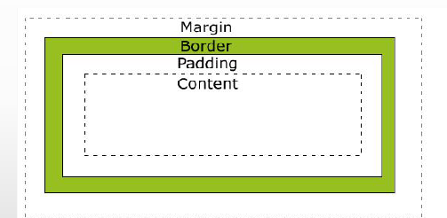
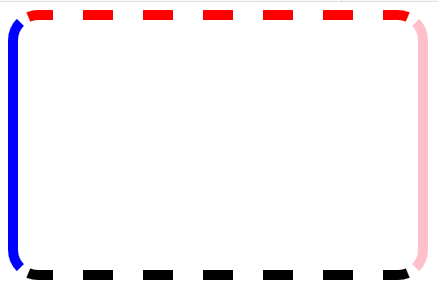
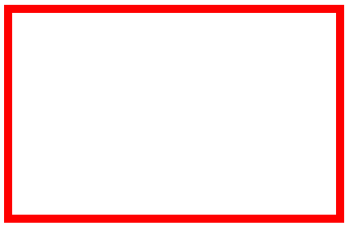

# 6 盒子模型

## 6.1 边框border

### 6.1.1 盒子模型结构

 

### 6.1.2 边框(border)样式

盒子的边框样式主要有三个方面：
* 边框的颜色(border-方向-color)
* 边框的粗细(border-方向-width)
* 边框的特征(border-方向-style)

边框颜色：
* border-top-color：上边框颜色
* border-bottom-color：下边框颜色
* border-left-color：左边框颜色
* border-right-color：右边框颜色
* border-color：四个边框的所有颜色

边框粗细：
* border-top-width：上边框粗细
* border-bottom-width：下边框粗细
* border-left-width：左边框粗细
* border-right-width：右边框粗细
* border-width：四个边框的统一粗细

边框特征：常用值none hidden dotted dashed solid double
* border-top-style：上边框特征
* border-bottom-style：下边框特征
* border-left-style：左边框特征
* border-right-style：右边框特征
* border-style：四个边框的统一特征

### 6.1.3 案例演示

#### 6.1.3.1 盒子的边框样式

 

	<!DOCTYPE html>
	<html lang="en">
	<head>
		<meta charset="UTF-8">
		<title>盒子模型的边框样式</title>
		
	</head>
	<body>
		

	</body>
	</html>

#### 6.1.3.2 盒子的边框样式

 

	<!DOCTYPE html>
	<html lang="en">
	<head>
		<meta charset="UTF-8">
		<title>盒子模型边框2</title>
		
	</head>
	<body>
		

	</body>
	</html>

### 6.1.4 总结

盒子模型由3部分构成：分别是边框(border)、内边距(padding)、外边距(margin)
本节课讲的是边框(border)，边框是看得见的。我们可以通过border-方向-color来控制边框的颜色；通过border-方向-width控制边框的粗细；通过border-方向-style来控制边框的样式。