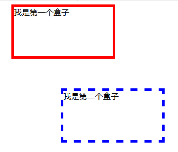
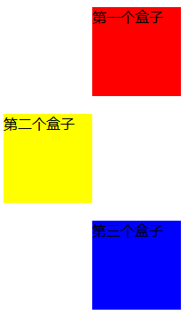
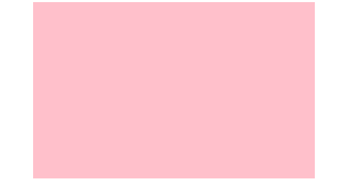

## 6.2 外边距margin

### 6.2.1 边界样式

边界(外边距，margin)：盒子模型中边框(border)的最外一层就是盒子的边界线，边界线是无色透明看不见的，因此不能够控制边界线的颜色和粗细。边框与边界线之间的距离称之为”外边距”。
* margin-top：上外边距
* margin-bottom：下外边距
* margin-left：左外边距
* margin-right：右外边距
* margin：上右下左

### 6.2.2 案例演示

示例1

 

	<!DOCTYPE html>
	<html lang="en">
	<head>
		<meta charset="UTF-8">
		<title>盒子模型的外边距(margin)</title>
		
	</head>
	<body>
		
我是第一个盒子

		
我是第二个盒子

	</body>
	</html>

示例2

 

	<!DOCTYPE html>
	<html lang="en">
	<head>
		<meta charset="UTF-8">
		<title>盒子边界2</title>
		
	</head>
	<body>
		
第一个盒子

		
第二个盒子

		
第三个盒子

	</body>
	</html>

示例3

	 
	
	<!DOCTYPE html>
	<html lang="en">
	<head>
		<meta charset="UTF-8">
		<title>通过盒子模型中的边界可以将某一个盒子居中</title>
		
	</head>
	<body>
		

	</body>
	</html>

### 6.2.3 总结

边界线：盒子模型中边框(border)的最外一层是边界线，边界线是无色透明看不见的。因此，学习起来比边框(边框可以设置颜色)要困难一些。

边界线与边框之间的距离称之为“外边距”，外边距总共有4个：分别为margin-top(上外边距)、margin-bottom（下外边距）、marginleft（左外边距）、margin-right（右外边距）

可以通过同时将盒子的margin-left、margin-right值设置为auto，从而将某一盒子居中显示。