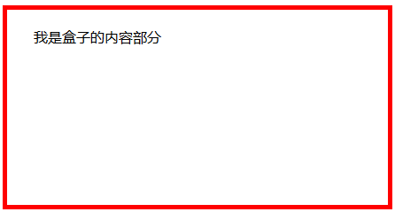
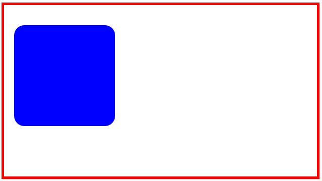

## 6.3 内边距padding

### 6.3.1 内边距样式

内边距(padding)：指盒子中的边框与盒子内容之间的距离，内边距同边界(margin)一样，是无色透明看不见的。
* padding-top：上内边距
* padding-bottom：下内边距
* padding-left：左内边距
* padding-right：右内边距
* padding：上右下左

### 6.3.2 案例演示

示例1

 

	<!DOCTYPE html>
	<html lang="en">
	<head>
		<meta charset="UTF-8">
		<title>内边距1</title>
		
	</head>
	<body>
		
我是盒子的内容部分

	</body>
	</html>

 

	<!DOCTYPE html>
	<html lang="en">
	<head>
		<meta charset="UTF-8">
		<title>内边距2</title>
		
	</head>
	<body>
		

			

		

	</body>
	</html>

### 6.3.3 总结

内边距(padding)：指盒子中的边框与盒子内容之间的距离，内边距同边界(margin)一样，是无色透明看不见的。

盒子模型总共有三个属性：分别是边框(border)、内边距、外边距

盒子的宽度=内容宽度+内边距宽度(透明)+外边距宽度(透明)