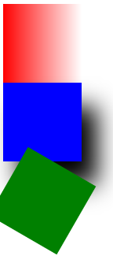

## 6.4 综合应用

### 6.4.1 综合应用

 

	<!DOCTYPE html>
	<html lang="en">
	<head>
		<meta charset="UTF-8">
		<title>玩转盒子</title>
		
	</head>
	<body>
		

		

		

	</body>
	</html>

### 6.4.2 总结

背景色渐变：通过CSS3中的linear-gradient属性来控制，语法为：-webkit-linear-gradient(方向，颜色1，颜色2)。  
并不是所有的浏览器都支持，不支持的话可以在“linear-gradient”前面加上浏览器内核名，如“-webkit-linear-gradient”

盒子阴影：box-shadow(x,y,z,颜色)

盒子旋转：transform：rotate(旋转角度)