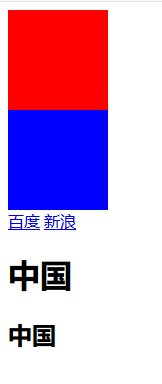
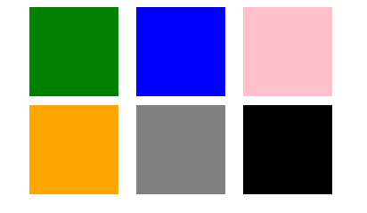

# 7 定位样式

## 7.1 浮动属性

### 7.1.1 浮动介绍

浮动作用：  
div、h1、h2等属于块级标签，块级标签会独占一行。  
如果想要让多个块级标签在一行显示，可以使用浮动属性来控制他们。

浮动在css中用float来表示，常用的值有left、right。

### 7.1.2 案例演示

示例1：

 

	<!DOCTYPE html>
	<html lang="en">
	<head>
		<meta charset="UTF-8">
		<title>块级标签的特点</title>
		
	</head>
	<body>
		<!-- div是块级标签(块级元素)，会单独占据一行 -->
		

		

	
		<!-- a标签属于行级标签，行级标签不会单独占据一行 -->
		<a href="#">百度</a>
		<a href="#">新浪</a>
	
		<h1>中国</h1>
		<h2>中国</h2>
	</body>
	</html>

示例2：

 

	<!DOCTYPE html>
	<html lang="en">
	<head>
		<meta charset="UTF-8">
		<title>浮动案例演示</title>
	</head>
	<body>
		<!-- 居中的前提是必须为某一个盒子指定宽度 -->
		

			

				

				

				

			

			

				

				

				

			

		

	</body>
	</html>

### 7.1.3 总结

由于div是块级标签，块级标签很霸道会独占一行。如果想让多个块级标签在一行显示，此时就需要用到浮动属性。