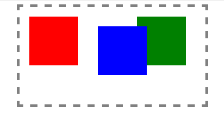

## 7.2 相对定位

### 7.2.1 position样式介绍

position的含义指定位，position常用的值有：  
relative（相对定位）、absolute(绝对定位)。

### 7.2.2 相对定位定义

相对定位(relative)：  
相对自身原来位置进行偏移，可以使用的值有top、left、right、bottom。

### 7.2.3 案例演示

 

	<!DOCTYPE html>
	<html lang="en">
	<head>
		<meta charset="UTF-8">
		<title>相对定位案例演示</title>
		
	</head>
	<body>
		

			

				

				

				

			

		

	</body>
	</html>

### 7.2.4 总结

相对定位中“相对”指的是相对自身而言。当position的属性值为relative时，指的就是相对定位。  
在相对定位中，原来的位置始终被保留着。
