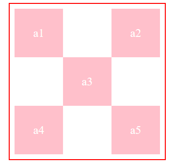

## 7.3 绝对定位

### 7.3.1 绝对定位定义

当position的属性值为absolute时，表示的是绝对定位。  
绝对定位(absolute)：  
使用了绝对定位的元素以它最近的一个“已经定位”的“祖先元素” 为基准进行偏移。如果没有已经定位的祖先元素，会以浏览器窗口为基准进行定位。

### 7.3.2 案例演示

 

	<!DOCTYPE html>
	<html lang="en">
	<head>
		<meta charset="UTF-8">
		<title>绝对定位案例演示</title>
		
	</head>
	<body>
		

			
a1

			
a2

			
a3

			
a4

			
a5

		

	</body>
	</html>

### 7.3.3 总结

到目前位置总共学习了4中定位的方式，分别是table定位、浮动定位、相对定位、绝对定位。  
相对定位是参照原来自身进行定位。而绝对定位是参照“拥有postion属性，且离自身最近”的元素作为参照物。  
在相对定位中，原来元素还占据位置；绝对定位中原来元素不占据位置。
