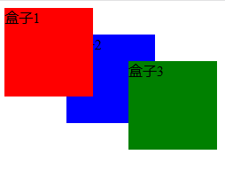

## 7.4 z-index属性

### 7.4.1 z-index属性定义

z-index 属性设置元素的堆叠顺序。  
拥有更高堆叠顺序的元素总是会处于堆叠顺序较低的元素的前面。

### 7.4.2 案例演示

 
	
	<!DOCTYPE html>
	<html lang="en">
	<head>
		<meta charset="UTF-8">
		<title>z-index案例演示</title>
		
	</head>
	<body>
		
盒子1

		
盒子2

		
盒子3

	</body>
	</html>

### 7.4.3 总结

* z-index属性可以设置两个盒子堆叠的先后关系
* 拥有更高堆叠顺序的元素总是会处于堆叠顺序较低的元素的前面。
* 元素可拥有负的 z-index 属性值。
* 仅能在定位元素上奏效